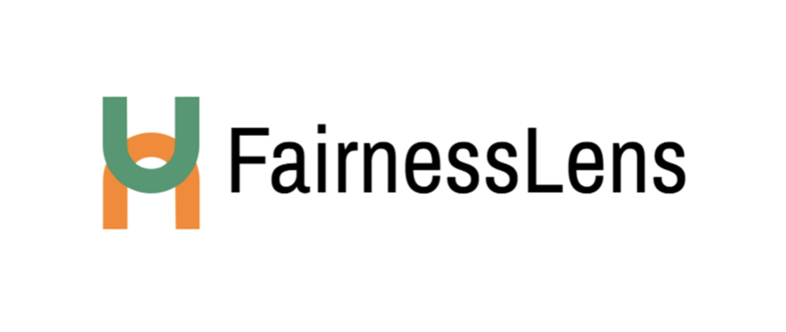
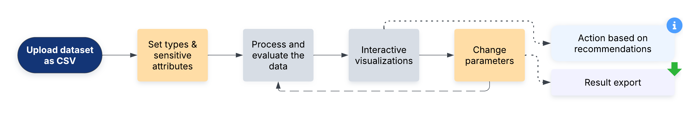
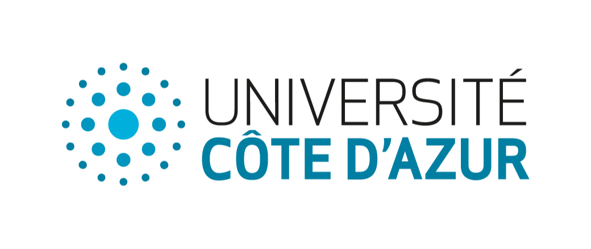
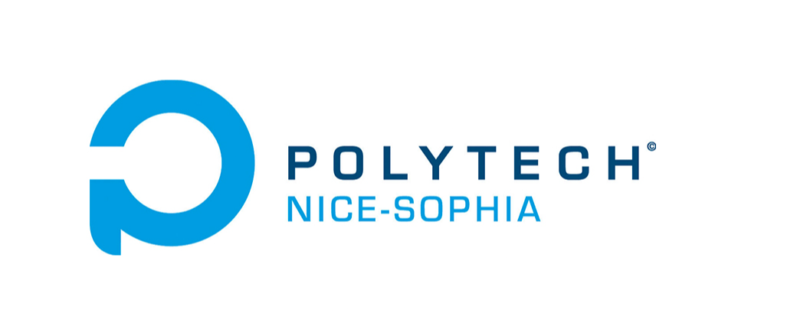

# FairnessLens

Fairness in Machine Learning Models (PER2024-030)

## Authors

-   Adam DIENES / EIT Digital M2 (adam.dienes@etu.univ-cotedazur.fr)
-   Bence Zsolt BEREGI / EIT Digital M2 (bence-zsolt.beregi@etu.univ-cotedazur.fr)

## Supervisors

-   Mireille Blay-Fornarino / I3S (mireille.blay@univ-cotedazur.fr)
-   Anne-Marie Pinna-Dery / I3S (anne-marie.pinna@univ-cotedazur.fr)

## University

-   University Côte d'Azur, Campus SophiaTech, 930 route des Colles BP145, 06903 Sophia-Antipolis Cedex, France (https://polytech.univ-cotedazur.fr)

## Abstract

As artificial intelligence increasingly influences critical decisions, ensuring model and dataset fairness is paramount. Our scientific research addresses the challenge of systematically visualizing and justifying the fairness of datasets and machine learning models throughout their lifecycle. We aim to bridge the gap between complex algorithms and real-world impact, empowering both model integrators and AI developers to build more equitable and transparent AI systems. We propose interactive visualizations that assess fairness without accessing sensitive attributes.

## Features

-   Systematic visualization of dataset and model fairness
-   Interactive tools for assessing fairness without sensitive attribute access
-   Tools to bridge the gap between complex algorithms and real-world AI system impacts
-   Fairness metrics throughout the machine learning model lifecycle



## Installation and Setup

Follow the instructions below to clone the repository and set up the project on your local machine.

### Clone the Repository

```bash
git clone https://github.com/Bence749/FairnessLens
```

### Intall Python and dependencies

**Install Python**

-   Ensure you have Python 3.12 installed on your system. You can download it from the official Python website. (https://www.python.org/downloads)
- **Important as with Python 3.13 it is not working**

### Host the Mercury frontend on localhost

Use PowerShell on Windows for the correct environment.

Run the following command

```bash
python3 --version
```

Then create a `.venv`

```bash
pythonX.Y -m venv .venv #X.Y is the Python version from the step before
```

Activate this `.venv` that we created

```bash
source .venv/bin/activate
```

Install Mercury

```bash
pip install mercury
```

Run Mercury and then select your notebook. Other packages will be installed automatically

```bash
python -m pip install --upgrade pip==25.0.1
```

Copy required folder

Copy the folder named `src` into the folder `.venv/lib/pythonX.Y/site-packages/mercury` (`X.Y` is your installed Python version)

Host Mercury frontend localhost

```bash
mercury run
```

Access the Mercury frontend on [127.0.0.1:8000](http://127.0.0.1:8000)

## License

This project is licensed under the MIT License - see the LICENSE file for details.



